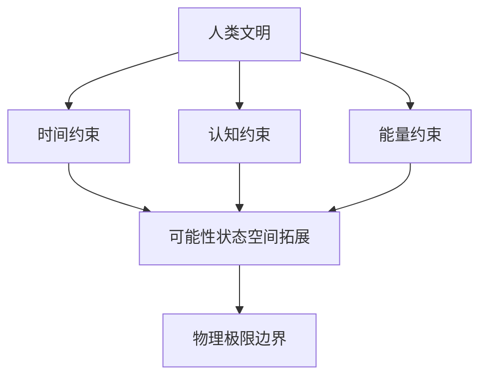

<!--
-------------------------------------------------------------------------------
  永生计划 (Immortality Project) - 中文文档
  
-------------------------------------------------------------------------------
-->
<p align="center">
  
</p>

<div align="center">

# 永生计划

## Immortality Project

**一种系统性消除人类文明存在性约束的理论框架**

*A Systematic Framework for Eliminating Existential Constraints of Human Civilization*

---

<p>
  <a href="../../LICENSE"></a>
  <a href="https://github.com/tukuaiai/immortality"></a>
  <a href="https://github.com/tukuaiai/immortality"></a>
  <a href="https://github.com/tukuaiai/immortality/pulls"></a>
</p>

<p>
  <strong>中文</strong> | <a href="../en/README.md">English</a>
</p>

[📖 核心文档](#-核心文档) •
[🎯 理论框架](#-理论框架) •
[🚀 三维路径](#-三维路径) •
[📚 学术资源](#-学术资源) •
[🤝 参与贡献](#-参与贡献)

</div>

---

## 摘要

本研究提出一种系统性理论框架，旨在分析并突破制约人类文明发展的三类存在性约束：**时间约束**（有限生命周期）、**认知约束**（神经系统信息处理局限）与**能量约束**（热力学效率边界）。该框架的核心目标在于最大化文明可达状态空间的测度，而非追求特定终态的效用最大化。本文系统阐述了各维度的技术路径、物理边界及伦理考量。

**关键词**：无限期生命延续、寿命延长逃逸速度、神经-计算机接口、全脑仿真、可逆计算、存在性约束

---

## 1. 引言

### 1.1 研究背景

当代人类文明面临三类根本性存在约束，这些约束共同限制了文明可达状态空间的边界：

| 约束维度 | 约束机制 | 理论突破路径 | 目标终态 |
|:---:|:---|:---|:---:|
| **时间** | 生物衰老导致有限生命周期 | 寿命延长逃逸速度 (Longevity Escape Velocity, LEV) | Y(t) → ∞ |
| **认知** | 神经系统带宽与处理能力局限 | 神经-计算机接口 (Brain-Computer Interface, BCI) | P(实现) ≈ 1 |
| **能量** | 热力学第二定律导致熵增耗散 | 可逆计算与熵效率优化 | η → 1, ΔS → 0 |

### 1.2 核心命题

> **文明的终极目标并非抵达某种特定的最优状态，而是致力于扩展其可达状态的集合本身。**

该命题区别于传统功利主义（最大化效用）与存在主义（强调自由选择），转而关注**可能性空间的测度最大化**。

### 1.3 理论定位



---

## 2. 理论框架

### 2.1 核心原则

本框架基于以下三项元原则：

| 序号 | 原则 | 操作性定义 |
|:---:|:---|:---|
| 1 | **可能性优先于实现** | 状态空间的测度 |A| 优先于任意特定状态 s∈A 的效用 U(s) |
| 2 | **选项优先于选择** | 可选行动集合的基数 |O| 优先于已执行行动的评价 |
| 3 | **潜能优先于现实** | 系统的可达配置数优先于当前配置的优化程度 |

### 2.2 与现有理论的比较分析

| 理论流派 | 核心目标 | 本框架的差异 | 关键区别 |
|:---:|:---:|:---|:---:|
| **功利主义** | 最大化效用总和 | 追求选项集合的扩展，而非效用最大化 | 量变 vs 质变 |
| **存在主义** | 强调自由选择 | 追求可选项的数量级提升 | 自由度的量化 |
| **加速主义** | 技术进步本身 | 设定明确的三维终点与物理边界 | 对有限性的自觉认知 |
| **超人类主义** | 超越生物限制 | 系统化三维框架与边界意识 | 结构化路径 |

### 2.3 数学形式化

**时间维度效能积分**：

$$Y(t) = \int_{0}^{T} W(t) \, dt$$

其中 $W(t)$ 为时刻 $t$ 的效能函数，$T$ 为生命周期。当寿命延长速率 $\Delta LE \geq 1$ 年/年时：

$$\lim_{t \to \infty} Y(t) = \infty$$

**认知维度可达率**：

传统模式下，实现复杂目标需满足多维条件约束：

$$P(\text{实现}) = \prod_{i=1}^{n} P(A_i) \to 0 \quad \text{当} \, n \to \infty$$

通过神经接口技术降维后：

$$P(\text{实现}) \approx 1 \quad \text{（仅需神经信号输入）}$$

**能量维度效率边界**：

$$\eta \to 1, \quad \Delta S \to 0$$

其中 $\eta$ 为能量循环效率，$\Delta S$ 为系统熵增。Landauer 极限定义了信息擦除的最小能耗：

$$Q_{\min} = kT \ln 2 \cdot \Delta I$$

---

## 3. 三维路径

### 3.1 时间维度：寿命延长逃逸速度 (LEV)

#### 3.1.1 核心目标

将生命周期效能积分从有界常量转化为无界函数。

#### 3.1.2 技术路径

| 技术领域 | 当前状态 | 预计突破时间 |
|:---|:---:|:---:|
| 衰老标志物干预 | 临床前/I期 | 2025-2030 |
| 基因编辑 (CRISPR) | 临床应用中 | 2025-2035 |
| 细胞重编程 | 动物实验 | 2030-2040 |
| 器官再生 | 早期研究 | 2035-2050 |
| 全脑仿真 (WBE) | 理论阶段 | 2050+ |

#### 3.1.3 关键文献

- López-Otín, C., et al. (2023). Hallmarks of aging: An expanding universe. *Cell*, 186(2), 243-278.
- Ocampo, A., et al. (2016). In vivo amelioration of age-associated hallmarks by partial reprogramming. *Cell*, 167(7), 1719-1733.

---

### 3.2 认知维度：神经-计算机接口 (BCI)

#### 3.2.1 核心目标

将多维条件约束降维为单维能量输入，实现体验与物理约束的解耦。

#### 3.2.2 技术路径

| 技术领域 | 当前状态 | 预计突破时间 |
|:---|:---:|:---:|
| 侵入式 BCI (运动解码) | 临床试验 | 2025-2030 |
| 高带宽双向接口 | 原型阶段 | 2030-2040 |
| 记忆编码/解码 | 动物实验 | 2035-2045 |
| 神经互联网 | 理论阶段 | 2050+ |

#### 3.2.3 关键文献

- Willett, F. R., et al. (2023). A high-performance speech neuroprosthesis. *Nature*, 620, 1031-1036.
- Musk, E., & Neuralink. (2019). An integrated brain-machine interface platform. *Journal of Medical Internet Research*, 21(10), e16194.

---

### 3.3 能量维度：熵效率与可逆计算

#### 3.3.1 核心目标

逼近热力学效率极限，实现系统的长期可持续运行。

#### 3.3.2 技术路径

| 技术领域 | 当前状态 | 预计突破时间 |
|:---|:---:|:---:|
| 核聚变发电 | 实验阶段 | 2030-2050 |
| 高密度储能 | 商业化中 | 2025-2035 |
| 可逆计算架构 | 理论研究 | 2040+ |
| 神经形态计算 | 早期商用 | 2025-2030 |

#### 3.3.3 关键文献

- Landauer, R. (1961). Irreversibility and heat generation in the computing process. *IBM Journal of Research and Development*, 5(3), 183-191.
- Bennett, C. H. (1982). The thermodynamics of computation—a review. *International Journal of Theoretical Physics*, 21(12), 905-940.

---

## 4. 物理边界

本框架明确承认以下物理极限：

| 极限 | 定义 | 对本框架的约束 |
|:---|:---|:---|
| **Bekenstein 界** | 有界区域的最大信息容量 | 神经核心的信息存储上限 |
| **Bremermann 极限** | 单位质量的最大计算速率 | 认知处理速度的理论天花板 |
| **Landauer 原理** | 信息擦除的最小能耗 | 计算效率的热力学边界 |

> **立场声明**：本框架的目标是在物理定律允许的范围内最大化可能性空间，而非幻想超越物理定律本身。

---

## 5. 核心文档

### 5.1 核心理论 (docs/core/)

| 文档 | 说明 |
|:---|:---|
| [human_3.0_technical_blueprint.md](./docs/core/human_3.0_technical_blueprint.md) | 模块化神经架构技术蓝图 |
| [immortality_27_elements.md](./docs/core/immortality_27_elements.md) | 时间维度突破 27 要素清单 |
| [human_3.0_architecture.md](./docs/core/human_3.0_architecture.md) | 开放式神经核心架构设计 |

### 5.2 哲学探讨 (docs/philosophy/)

| 文档 | 说明 |
|:---|:---|
| [ontology_experience_machine.md](./docs/philosophy/ontology_experience_machine.md) | 本体论分岔与体验机器终局 |
| [emotion_modeling.md](./docs/philosophy/emotion_modeling.md) | 情感神经编解码与注入 |

### 5.3 实践指南 (docs/guides/)

| 文档 | 说明 |
|:---|:---|
| [human_3.0_social_media.md](./docs/guides/human_3.0_social_media.md) | 技术蓝图通俗版 |

### 5.4 辅助资源

| 目录 | 说明 |
|:---|:---|
| [docs/system_architecture.mmd](./docs/system_architecture.mmd) | 系统架构图 (Mermaid) |
| [archives/](./archives/) | 历史文档与评审记录 |
| [data/](./data/) | 数据模板与参考文献 |

---

## 6. 实施路线图

| 阶段 | 时间范围 | 核心目标 | 关键里程碑 | 状态 |
|:---:|:---:|:---|:---|:---:|
| **0** | 0-6月 | 理论框架完善 | 白皮书 v1.0 发布 | ✅ 进行中 |
| **1** | 6-18月 | 学术信誉建立 | 同行评审论文发表 | 🔄 规划中 |
| **2** | 18-36月 | 证据库构建 | 技术数据库上线 | ⏳ 待启动 |
| **3** | 3-5年 | 原型验证 | 概念验证实验 | ⏳ 待启动 |
| **4** | 5-10年 | 组织建立 | 研究机构成立 | ⏳ 待启动 |
| **5** | 10-30年 | 技术攻关 | 单维度实质突破 | ⏳ 待启动 |

---

## 7. 关键绩效指标

### 7.1 时间维度

| 指标 | 定义 | 目标值 |
|:---|:---|:---:|
| ΔLE | 年均寿命延长增量 | ≥1 年/年 |
| HALE/LE | 健康寿命占比 | → 1.0 |
| 衰老相关死亡率 | 年降幅 | -5%/年 |

### 7.2 认知维度

| 指标 | 定义 | 目标值 |
|:---|:---|:---:|
| BCI 带宽 | 信息传输速率 | >100 Mbps |
| 读写误差率 | 神经信号解码精度 | <0.1% |
| 体验一致性 | 主观-客观相关系数 | >0.99 |

### 7.3 能量维度

| 指标 | 定义 | 目标值 |
|:---|:---|:---:|
| 系统效率 η | 能量转换效率 | → 1.0 |
| EROEI | 能源投入产出比 | >50:1 |
| 单位能耗 | 每可能性状态能耗 | → Landauer 极限 |

---

## 8. 风险与伦理

### 8.1 已识别风险

| 风险类别 | 说明 | 缓解策略 |
|:---:|:---|:---|
| **技术瓶颈** | 关键技术长期无法突破 | 多路径并行研究 |
| **伦理争议** | 神经编辑等技术的监管限制 | 主动参与伦理框架建设 |
| **分配不公** | 技术加剧社会不平等 | 推动公共可及性政策 |
| **意义危机** | 约束消除后的虚无主义风险 | 哲学研究与心理支持 |

### 8.2 伦理原则

| 原则 | 操作性定义 |
|:---:|:---|
| **最小侵入** | 技术应用遵循渐进原则，优先非侵入式方案 |
| **可审计** | 所有神经干预操作可追溯、可验证 |
| **可撤销** | 用户保留退出与逆转的权利 |
| **公平可及** | 避免技术特权固化，推动普惠性应用 |

---

## 9. 学术资源

### 9.1 核心文献

**哲学基础**：
1. Bostrom, N. (2005). A history of transhumanist thought. *Journal of Evolution and Technology*, 14(1).
2. Parfit, D. (1984). *Reasons and Persons*. Oxford University Press.

**生物老年学**：
3. López-Otín, C., et al. (2023). Hallmarks of aging: An expanding universe. *Cell*, 186(2), 243-278.
4. de Grey, A., & Rae, M. (2007). *Ending Aging*. St. Martin's Press.

**神经科学**：
5. Willett, F. R., et al. (2023). A high-performance speech neuroprosthesis. *Nature*, 620, 1031-1036.
6. Koch, C. (2004). *The Quest for Consciousness*. Roberts & Company.

**物理极限**：
7. Landauer, R. (1961). Irreversibility and heat generation. *IBM Journal*, 5(3), 183-191.
8. Lloyd, S. (2000). Ultimate physical limits to computation. *Nature*, 406, 1047-1054.
9. Bekenstein, J. D. (1981). Universal upper bound on the entropy-to-energy ratio. *Physical Review D*, 23(2), 287.

### 9.2 推荐书目

| 书籍 | 作者 | 领域 |
|:---|:---|:---|
| *Ending Aging* | Aubrey de Grey | 生物老年学 |
| *Superintelligence* | Nick Bostrom | AI 安全 |
| *Lifespan* | David Sinclair | 衰老科学 |
| *Programming the Universe* | Seth Lloyd | 量子计算 |

### 9.3 学术社区

| 社区 | 说明 | 链接 |
|:---|:---|:---|
| LessWrong | 理性主义与 AI 安全讨论 | [lesswrong.com](https://www.lesswrong.com) |
| EA Forum | 有效利他主义社区 | [forum.effectivealtruism.org](https://forum.effectivealtruism.org) |
| r/Longevity | 延寿技术讨论 | [reddit.com/r/longevity](https://reddit.com/r/longevity) |

---

## 10. 参与贡献

### 10.1 贡献领域

| 角色 | 贡献方向 |
|:---:|:---|
| 哲学研究者 | 理论框架完善与批判性分析 |
| 生命科学家 | 衰老机制与干预技术反馈 |
| 神经科学家 | BCI 与神经编码研究 |
| 工程师 | 原型开发与工具构建 |
| 伦理学家 | 伦理框架与治理建议 |

### 10.2 贡献流程

```bash
# 1. Fork 本仓库
# 2. 创建特性分支
git checkout -b feature/contribution-topic

# 3. 提交更改
git commit -m 'Add: contribution description'

# 4. 推送并创建 Pull Request
git push origin feature/contribution-topic
```

详细指南请参阅 [CONTRIBUTING.md](../../CONTRIBUTING.md)。

---

## 11. 联系方式

| 平台 | 链接 |
|:---:|:---|
| **GitHub** | [@tukuaiai](https://github.com/tukuaiai) |
| **Twitter / X** | [@123olp](https://x.com/123olp) |
| **Telegram** | [@desci0](https://t.me/desci0) |
| **Email** | tukuai.ai@gmail.com |

---

## 12. 许可证

本项目采用 [CC BY-NC-SA 4.0](../../LICENSE) 许可证。

- ✅ 允许：共享、演绎
- 📌 要求：署名、非商业性使用、相同方式共享

---

## 致谢

本研究受益于以下先驱者的工作：

- **Aubrey de Grey** (SENS Research Foundation) — 衰老工程学
- **Nick Bostrom** (Future of Humanity Institute) — 存在风险研究
- **Ray Kurzweil** (Google) — 奇点理论
- **全球超人类主义社区** — 可能性探索

---

<div align="center">

## 核心论断

> *"生命不是倒计时，而是累加器。"*

> *"真正的自由不是想做什么，而是有多少种可能。"*

> *"熵是系统永续性的核心制约因素，也是文明的终极使命。"*

---

### ⭐ 如果本项目对您有启发，请考虑点亮 Star

[](https://star-history.com/#tukuaiai/immortality&Date)

---

**永生计划研究团队**

[⬆ 返回顶部](#永生计划)

</div>
