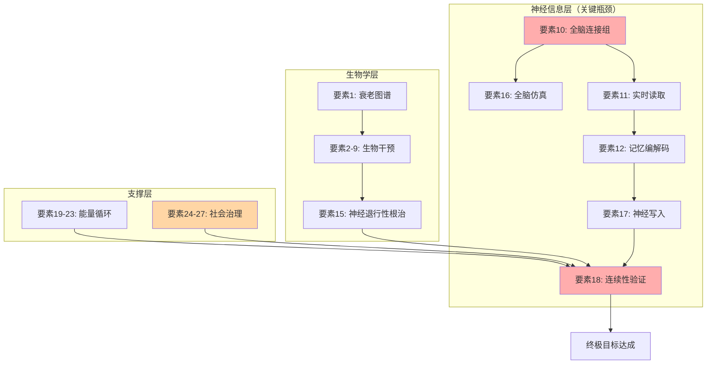

# 时间维度突破：27要素技术清单

**文档类型**：技术规范
**版本**：2.1
**最后更新**：2025-12-25
**所属模块**：永生计划 · 时间维度

---

## 摘要

本文档系统梳理实现寿命延长逃逸速度 (Longevity Escape Velocity, LEV) 所需的27项关键技术要素。各要素按功能层次划分为四大类别：生物学基础（9项）、神经信息层（9项）、能量与物质循环（5项）、社会与治理（4项）。本清单旨在为研究优先级排序与资源配置提供系统性参考框架。

**关键词**：寿命延长逃逸速度、衰老标志物、全脑仿真、神经编码、意识连续性

---

## 1. 引言

### 1.1 理论基础

任何复杂目标的实现，本质上是其所有必要构成要素的集合。本清单的任务是识别、定义并追踪实现无限期生命延续所需的全部技术要素。

### 1.2 目标操作性定义

| 目标层次 | 定义 | 验收标准 |
|:---|:---|:---|
| **终极目标** | 意识在时间维度上的无限延续 | t → ∞ 时系统功能维持 |
| **主观连续性** | 个体主观体验流不中断 | 自我同一性保持 |
| **物理连续性** | 承载意识的系统持续运行 | 硬件/基质可维护或替换 |
| **可验证性** | 外部观察者可确认身份延续 | 客观测试协议通过 |

---

## 2. 要素清单

### 2.1 第一部分：生物学基础（要素 1-9）

#### 要素 1：衰老机制完全图谱

| 属性 | 值 |
|:---|:---|
| **完成度** | 80% |
| **描述** | 明确所有衰老标志物 (Hallmarks of Aging) 及其因果关系网络 |
| **当前状态** | López-Otín (2023) 版本已识别12项标志物，优先级与网络关系待明确 |
| **行动项** | 建立多组学统一数据库，开展大规模纵向研究 |
| **关键文献** | López-Otín et al. (2023). *Cell*, 186(2), 243-278 |

#### 要素 2：端粒维持技术

| 属性 | 值 |
|:---|:---|
| **完成度** | 60% |
| **描述** | 安全、可控地维持端粒长度，同时不增加癌症风险 |
| **技术路径** | 可逆端粒酶激活开关 + 高精度癌症监测系统 |
| **风险** | 端粒酶过度激活与肿瘤发生的关联 |

#### 要素 3：衰老细胞清除 (Senolytics)

| 属性 | 值 |
|:---|:---|
| **完成度** | 40% |
| **描述** | 高效、特异性清除体内衰老细胞 |
| **技术路径** | 新一代靶向性 Senolytics 药物 + 纳米递送系统 |
| **当前进展** | Dasatinib + Quercetin 组合已进入临床试验 |

#### 要素 4：干细胞再生库

| 属性 | 值 |
|:---|:---|
| **完成度** | 50% |
| **描述** | 建立个人专用诱导多能干细胞 (iPSC) 库 |
| **技术路径** | 标准化 iPSC 银行流程，每10年更新细胞样本 |
| **应用场景** | 器官再生、细胞替代治疗 |

#### 要素 5：器官再生与替换

| 属性 | 值 |
|:---|:---|
| **完成度** | 30% |
| **描述** | 实现复杂器官的体外培育与功能性移植 |
| **关键瓶颈** | 器官血管化网络自组装技术 |
| **目标器官** | 心脏、肝脏、肾脏、大脑（部分） |

#### 要素 6：DNA 损伤修复强化

| 属性 | 值 |
|:---|:---|
| **完成度** | 20% |
| **描述** | 全基因组累积损伤的定期、高效、安全修复 |
| **技术路径** | 体内 CRISPR 递送系统 + 实时测序验证 |
| **目标** | 建立"年度基因维护计划" |

#### 要素 7：蛋白质稳态恢复

| 属性 | 值 |
|:---|:---|
| **完成度** | 35% |
| **描述** | 增强细胞内蛋白质质量控制体系 |
| **技术路径** | 激活自噬 + 增强热休克蛋白 (HSP) + 泛素-蛋白酶体系统 (UPS) |

#### 要素 8：线粒体功能优化

| 属性 | 值 |
|:---|:---|
| **完成度** | 25% |
| **描述** | 修复和替换功能衰退的线粒体 |
| **技术路径** | 线粒体靶向基因编辑 + 线粒体移植技术 |

#### 要素 9：免疫系统年轻化

| 属性 | 值 |
|:---|:---|
| **完成度** | 40% |
| **描述** | 重置衰老免疫系统，恢复功能和多样性 |
| **技术路径** | 胸腺再生 + 造血干细胞年轻化 + 慢性炎症控制 |

---

### 2.2 第二部分：神经信息层（要素 10-18）

#### 要素 10：全脑连接组测绘

| 属性 | 值 |
|:---|:---|
| **完成度** | 15% |
| **描述** | 以突触级分辨率绘制人脑 860 亿神经元的完整连接图谱 |
| **当前进展** | Human Connectome Project 已完成宏观连接组 |
| **关键瓶颈** | 电子显微镜通量、数据存储与处理能力 |

#### 要素 11：神经活动实时读取

| 属性 | 值 |
|:---|:---|
| **完成度** | 30% |
| **描述** | 全脑范围、单神经元分辨率、毫秒级精度的实时读取 |
| **当前状态** | Neuralink N1 实现 1024 通道 |
| **目标** | 百万通道级别神经-计算机接口 |

#### 要素 12：记忆编码与解码

| 属性 | 值 |
|:---|:---|
| **完成度** | 10% |
| **描述** | 破译大脑存储复杂记忆的编码规则 |
| **技术路径** | 建立记忆印迹 (Engram) 数据库 + 神经活动到符号表示的解码算法 |
| **关键文献** | Tonegawa et al. (2015). *Neuron*, 87(5), 918-931 |

#### 要素 13：意识的神经关联物 (NCC)

| 属性 | 值 |
|:---|:---|
| **完成度** | 20% |
| **描述** | 精确识别维持意识体验所必需的最小神经活动模式 |
| **理论框架** | 整合信息理论 (IIT)、全局工作空间理论 (GWT) |
| **实验方法** | 麻醉、睡眠等不同意识水平下的对比研究 |

#### 要素 14：神经可塑性维持

| 属性 | 值 |
|:---|:---|
| **完成度** | 45% |
| **描述** | 防止因衰老导致的学习和记忆能力下降 |
| **技术路径** | 维持突触密度和髓鞘健康，增强"认知储备" |

#### 要素 15：神经退行性疾病根治

| 属性 | 值 |
|:---|:---|
| **完成度** | 35% |
| **描述** | 根除阿尔茨海默病、帕金森病等神经退行性疾病 |
| **技术路径** | 清除异常蛋白聚集 (Aβ, Tau, α-synuclein) 的免疫疗法 |

#### 要素 16：全脑仿真 (WBE)

| 属性 | 值 |
|:---|:---|
| **完成度** | 5% |
| **描述** | 实现大脑结构和功能的完全数字化 |
| **技术路径** | 从简单生物（线虫、果蝇）逐步推进至哺乳动物 |
| **当前状态** | OpenWorm 项目已完成秀丽隐杆线虫 302 神经元仿真 |

#### 要素 17：神经写入技术

| 属性 | 值 |
|:---|:---|
| **完成度** | 8% |
| **描述** | 对大脑特定神经元进行精确、安全的信息写入 |
| **技术路径** | 超声 + 基因递送组合、光遗传学、磁遗传学 |

#### 要素 18：意识连续性验证

| 属性 | 值 |
|:---|:---|
| **完成度** | 0% |
| **描述** | 建立可操作的协议，验证意识在不同基质间转移后的同一性 |
| **挑战** | 哲学与科学界尚未达成共识 |
| **方法论** | 设计"忒修斯之船"神经版本的思想实验与物理验证方案 |

---

### 2.3 第三部分：能量与物质循环（要素 19-23）

#### 要素 19：能量效率优化

| 属性 | 值 |
|:---|:---|
| **完成度** | 50% |
| **描述** | 将生命系统的计算和维持能耗逼近物理极限 |
| **理论边界** | Landauer 极限：$E_{min} = kT \ln 2$ |
| **技术路径** | 可逆计算、生物-光电混合能源系统 |

#### 要素 20：物质循环闭环

| 属性 | 值 |
|:---|:---|
| **完成度** | 60% |
| **描述** | 建立体外系统，替代或辅助肾脏、肝脏进行代谢废物处理 |
| **技术路径** | 可穿戴式人工肾脏和肝脏辅助设备 |

#### 要素 21：营养供应自动化

| 属性 | 值 |
|:---|:---|
| **完成度** | 70% |
| **描述** | 基于个体基因和实时代谢数据的全自动精准营养供应 |
| **技术路径** | 建立"营养数字孪生"模型 |

#### 要素 22：环境稳定性控制

| 属性 | 值 |
|:---|:---|
| **完成度** | 80% |
| **描述** | 设计能维持百年尺度的生命支持系统 |
| **技术路径** | 设计"生命舱"或类似封闭生态系统 |

#### 要素 23：对抗热力学第二定律

| 属性 | 值 |
|:---|:---|
| **完成度** | 5% (理论阶段) |
| **描述** | 维持系统作为远离平衡态的耗散结构，持续从环境获取负熵 |
| **理论基础** | 非平衡态热力学、信息与能量的关系 |

---

### 2.4 第四部分：社会与治理（要素 24-27）

#### 要素 24：伦理框架建立

| 属性 | 值 |
|:---|:---|
| **完成度** | 30% |
| **描述** | 建立针对寿命延长和全脑仿真技术的伦理规范与审查标准 |
| **行动项** | 起草"高级生命延续技术伦理宪章" |

#### 要素 25：法律身份延续

| 属性 | 值 |
|:---|:---|
| **完成度** | 10% |
| **描述** | 在法律上承认"数字人格"或"延续身份" |
| **挑战** | 意识转移后的法律地位、财产权、责任归属 |

#### 要素 26：资源分配机制

| 属性 | 值 |
|:---|:---|
| **完成度** | 20% |
| **描述** | 设计公平、透明的早期长寿技术资源分配机制 |
| **目标** | 避免出现"永生特权阶层" |

#### 要素 27：知识传承与更新

| 属性 | 值 |
|:---|:---|
| **完成度** | 40% |
| **描述** | 建立机制防止超长寿命个体带来的社会僵化 |
| **技术路径** | 设计"认知刷新协议"或强制性再教育体系 |

---

## 3. 依赖关系分析

### 3.1 关键路径

### 3.2 瓶颈分析

| 层次 | 平均完成度 | 关键瓶颈 |
|:---|:---:|:---|
| 生物学基础 | 42% | 器官再生、DNA修复 |
| 神经信息层 | 16% | 全脑连接组、意识连续性验证 |
| 能量循环 | 53% | 热力学极限逼近 |
| 社会治理 | 25% | 伦理框架、法律身份 |

### 3.3 执行优先级

**P0（立即启动）**：
1. 要素 1：建立衰老数据库
2. 要素 4：建立个人 iPSC 库
3. 要素 10：参与人类连接组项目
4. 要素 24：起草伦理宪章 v0.1

**P1（6-12个月内启动）**：
1. 要素 3：Senolytics 临床追踪
2. 要素 11：BCI 技术评估
3. 要素 19：能量效率基线测量

---

## 4. 资源需求估算

| 层级 | 时间跨度 | 预算范围 | 说明 |
|:---|:---:|:---:|:---|
| 个人 | 5年 | $50k - $200k | 基因测序、iPSC建库、健康监控 |
| 团队 | 10年 | $10M - $50M | 实验室、科研团队、临床前研究 |
| 人类 | 30年+ | >$100B | 国家级或全球合作项目 |

---

## 5. 参考文献

1. López-Otín, C., et al. (2023). Hallmarks of aging: An expanding universe. *Cell*, 186(2), 243-278.
2. Tonegawa, S., et al. (2015). Memory engram cells have come of age. *Neuron*, 87(5), 918-931.
3. Landauer, R. (1961). Irreversibility and heat generation in the computing process. *IBM Journal*, 5(3), 183-191.
4. de Grey, A., & Rae, M. (2007). *Ending Aging*. St. Martin's Press.

---

**文档版本**：2.1
**维护者**：永生计划研究团队
**许可证**：CC BY-NC-SA 4.0
